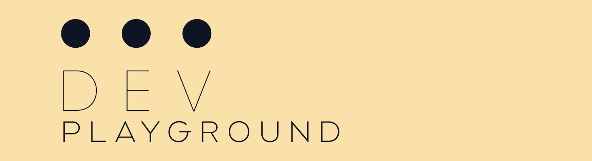

# DevPlayground


A mono repository for all sorts of training code.

## Content

* [C++](src/cpp/README.md)
* [github actions](src/github/README.md)
* [python](src/python/README.md)
* [bazel](src/bazel/README.md)
* [uv](src/uv/README.md)


## Setup the repo

We have a setup script that handles all necessary steps. Run it via

```bash
./set-me-up.py
```

It
- installs `clang-format-15` if not already available,
- installs `bazelisk` if not already available,
- installs `uv` if not already available,
- creates the `venv` using `uv`,
- installs python sub packages as editable packages.

