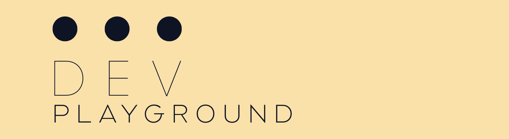

# DevPlayground Documentation



Welcome to the documentation of this dev-playground mono repository.
We bundle all sorts of training code as well as small code snippets
that came to our attention.

## Content

The content of this repo is to be ever-expanding (we aim to have it as a collection
of things we learned along the way).
Currently it consists of 

* C++ code snippets (mainly from leetcode)
* Setup of GitHub Actions
* Setup of the repo as a whole
* Various python scripts and smaller python packages
* uv for python dependency management
* Bazel as an overall build system


## Setup the repo

We have a setup script that handles all necessary steps. Run it via

```bash
./set-me-up.py
```

It
- installs `clang-format-15` if not already available,
- installs `bazelisk` if not already available,
- installs `uv` if not already available,
- creates the `venv` using `uv`,
- installs python sub packages as editable packages.

